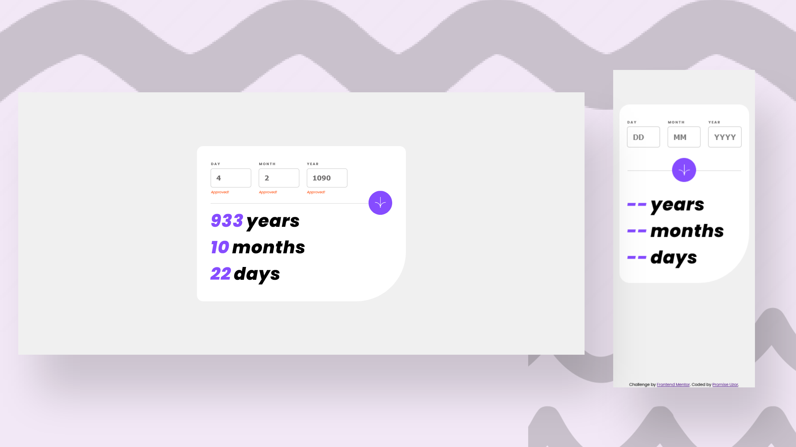

# Frontend Mentor - Age calculator app solution

This is a solution to the [Age calculator app challenge on Frontend Mentor](https://www.frontendmentor.io/challenges/age-calculator-app-dF9DFFpj-Q). Frontend Mentor challenges help you improve your coding skills by building realistic projects. 

## Built with

- Semantic HTML5 markup
- Plain CSS
- Javascript

## Screenshots



## View Live

You can view the live version of this project on GitHub Pages: [Age Calculator]https://iamupo.github.io/age-calculator/)

## Connect with Me

Feel free to connect with me on:

- [LinkedIn](https://www.linkedin.com/in/iamupo/)
- [x](https://www.x.com/iamupo/)

## Getting Started

To get a copy of this project and run it locally, follow these steps:

1. Clone the repository:

   ```bash
   git clone https://github.com/IamUPO/age-calculator.git
